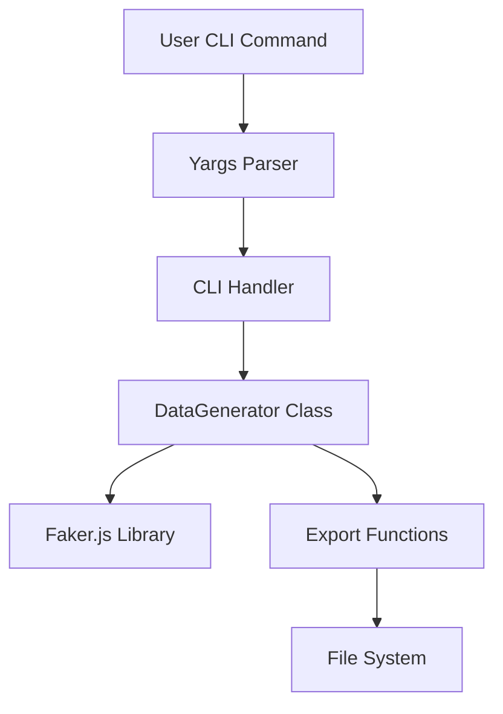

# Data-Crafter Mock Data Generator - Feature Enhancement Design

## LIBRARIES SYSTEM DOCUMENTATION SPECIALIZATIONS

Pay special attention to:
   - Public APIs and interfaces
   - Module/package organization
   - Extension points and plugin systems
   - Integration examples
   - Version compatibility information

## 1. Overview

The Data-Crafter Mock Data Generator is an npm package designed to create realistic mock data for development and testing purposes. This design document outlines improvements to enhance functionality, user experience, and discoverability of the package.

### Current Features
- Generate mock user data with configurable count, locale, and output
- Generate data based on custom JSON schemas
- Export generated data to JSON, CSV, and XML formats
- CLI interface for easy command-line usage

### Proposed Enhancements
1. Add new data generation capabilities
2. Improve CLI interface with new commands
3. Enhance export functionality
4. Update README with badges and improved documentation
5. Add configuration file support
6. Implement template system for common data structures
7. Add data relationship capabilities
8. Improve validation and error handling
9. Add streaming support for large datasets

## 2. Architecture

The package follows a CLI-based modular architecture written in TypeScript. It uses:
- `yargs` for CLI argument parsing
- `@faker-js/faker` for data generation
- TypeScript for type safety
- Modular design with separate components for CLI, core logic, and types



## 3. New Features Implementation

### 3.1 Enhanced Data Types
Add support for additional data types:
- Credit card information
- Company/organization data
- Internet-related data (IP, domain, URL)
- Finance data (currency, transaction)
- Color values
- Images (placeholder URLs)
- UUID generation
- Database IDs
- Latitude/longitude coordinates

### 3.2 Configuration File Support
Add support for a `.datacraftrc` configuration file to store default settings:
- Default locale
- Default export format
- Default output directory
- Custom data templates
- Default count for generation

### 3.3 Template System
Implement a template system for commonly used data structures:
- User profiles
- Product catalogs
- Order systems
- Blog posts
- Comments
- E-commerce data

### 3.4 Enhanced CLI Commands
Add new CLI commands:
- `generate:template` - Generate data from predefined templates
- `list:templates` - List available templates
- `init` - Initialize configuration file
- `validate:schema` - Validate a schema file

### 3.5 Improved Export Options
Enhance export functionality:
- Add support for streaming large datasets
- Add compression options (gzip)
- Add database export options (JSON to SQL insert statements)
- Add support for nested data structures in CSV export
- Add export to YAML format

### 3.6 Data Relationships
Implement data relationship capabilities:
- One-to-many relationships
- Many-to-many relationships
- Foreign key references
- Referential integrity in generated data

## 4. API Design

### Public APIs and Interfaces

The Data-Crafter library exposes several public APIs for generating mock data:

1. **DataGenerator Class**: The main class for generating mock data
2. **generateMockUser Function**: Generate mock user data
3. **generateCustomSchemaData Function**: Generate data based on custom schemas
4. **exportData Function**: Export data to various formats

### Module/Package Organization

The package is organized into the following modules:

- `DataGenerator`: Core data generation class
- `cli`: Command-line interface
- `types`: TypeScript type definitions
- `templates`: Predefined data templates (new)
- `config`: Configuration file handling (new)

### Extension Points and Plugin Systems

The library supports the following extension points:

1. Custom data type providers
2. Template system for predefined data structures
3. Configuration file customization
4. Custom export formats

### Integration Examples

```javascript
// Basic usage
const { generateMockUser } = require('data-crafter');
const users = generateMockUser(10);

// Using with custom schema
const { generateCustomSchemaData } = require('data-crafter');
const schema = {
  name: { type: 'string', length: 10 },
  age: { type: 'number', min: 18, max: 99 }
};
const data = generateCustomSchemaData(schema, 5);

// Using the new template system
const { generateFromTemplate } = require('data-crafter');
const userData = generateFromTemplate('user', 20);
```

### Version Compatibility Information

The library follows semantic versioning:

- Major versions may introduce breaking changes
- Minor versions add new features while maintaining backward compatibility
- Patch versions fix bugs without changing functionality

The current version (2.0.0) maintains backward compatibility with version 1.x while adding new features.

## 4. API Design

### 4.1 New DataGenerator Methods

| Method | Description | Parameters |
|--------|-------------|------------|
| `generateFromTemplate(templateName, count)` | Generate data from predefined templates | `templateName`: string, `count`: number |
| `listTemplates()` | List all available templates | None |
| `loadConfig()` | Load configuration from .datacraftrc | None |
| `validateSchema(schema)` | Validate a schema file | `schema`: DataSchema |
| `generateWithRelationships(schema, relationships, count)` | Generate related data sets | `schema`: DataSchema, `relationships`: RelationshipSchema, `count`: number |

### 4.2 New CLI Commands

| Command | Description | Options |
|---------|-------------|---------|
| `generate:template` | Generate data from templates | `--template`, `--count`, `--locale`, `--output` |
| `list:templates` | List available templates | None |
| `init` | Initialize configuration file | None |
| `validate:schema` | Validate schema file | `--schema` |
| `generate:related` | Generate related data sets | `--schemas`, `--relationships`, `--count`, `--output` |

## 5. Data Models

### 5.1 Configuration File Schema
```json
{
  "locale": "en",
  "defaultFormat": "json",
  "defaultCount": 10,
  "outputDir": "./data",
  "templates": {
    "user": "./templates/user.json",
    "product": "./templates/product.json",
    "order": "./templates/order.json"
  }
}
```

### 5.2 Extended Field Schema
```typescript
interface ExtendedFieldSchema {
  type: 'string' | 'number' | 'boolean' | 'date' | 'email' | 'phone' | 'address' | 'content' | 
        'creditCard' | 'company' | 'ip' | 'url' | 'currency' | 'color' | 'uuid' | 'image' | 
        'id' | 'coordinates' | 'hexColor' | 'macAddress';
  // Existing properties...
  pattern?: string;
  length?: number;
  min?: number;
  max?: number;
  float?: boolean;
  precision?: number;
  format?: 'sentence' | 'paragraph';
  // New properties...
  provider?: string; // For custom faker providers
  options?: any[];   // For enum-like values
}
```

### 5.3 Relationship Schema
```typescript
interface RelationshipSchema {
  [key: string]: {
    type: 'oneToMany' | 'manyToOne' | 'manyToMany';
    referencedTable: string;
    foreignKey: string;
    countRange?: { min: number; max: number };
  }
}
```

## 6. README Enhancement Plan

### 6.1 Badges to Add
- npm version
- Monthly downloads
- Build status
- License
- TypeScript support
- GitHub issues
- GitHub stars
- Dependencies status
- Bundle size

### 6.2 New Sections
- Quick start guide
- Configuration file usage
- Template system documentation
- Advanced examples
- API reference
- Contributing guidelines update
- Comparison with similar tools

### 6.3 Improved Examples
- More comprehensive schema examples
- Template usage examples
- Configuration file examples
- Integration examples with popular frameworks
- Relationship generation examples
- Large dataset generation examples

## 7. Implementation Plan

### Phase 1: Core Enhancements (Week 1)
- Implement new data types in DataGenerator class
- Add validation methods
- Extend FieldSchema interface
- Implement relationship generation capabilities

### Phase 2: CLI Improvements (Week 2)
- Add new CLI commands
- Implement configuration file support
- Add template system
- Implement schema validation command

### Phase 3: Export Enhancements (Week 3)
- Improve export functionality
- Add streaming support for large datasets
- Add compression options
- Add YAML export format

### Phase 4: Documentation & Release (Week 4)
- Update README with badges and new documentation
- Create template examples
- Create relationship examples
- Publish new version

## 8. Testing Strategy

### Unit Tests
- Test new data generation methods
- Validate schema validation functionality
- Test configuration file loading
- Verify template system
- Test relationship generation

### Integration Tests
- Test CLI commands with new features
- Validate export functionality with new formats
- Test configuration file integration
- Test large dataset generation and streaming

### Example Test Cases
```javascript
// Test new credit card generation
test('generates valid credit card data', () => {
  const schema = {
    card: { type: 'creditCard' }
  };
  const data = generateCustomSchemaData(schema, 1);
  expect(data[0].card).toMatch(/^\d{4}-\d{4}-\d{4}-\d{4}$/);
});

// Test configuration file loading
test('loads configuration from file', () => {
  const config = loadConfig();
  expect(config.locale).toBe('en');
  expect(config.defaultFormat).toBe('json');
});

// Test relationship generation
test('generates related data correctly', () => {
  const userSchema = { id: { type: 'uuid' }, name: { type: 'string' } };
  const orderSchema = { id: { type: 'uuid' }, userId: { type: 'uuid' } };
  const relationships = { orders: { type: 'oneToMany', referencedTable: 'orders', foreignKey: 'userId' } };
  
  const { users, orders } = generateWithRelationships(userSchema, orderSchema, relationships, 2, 4);
  
  expect(users.length).toBe(2);
  expect(orders.length).toBe(4);
  expect(orders.every(order => users.some(user => user.id === order.userId))).toBe(true);
});
```

## 9. Backward Compatibility

All new features will be implemented in a backward-compatible manner:
- Existing API methods will remain unchanged
- New data types will be additive only
- CLI commands will maintain existing functionality
- Schema validation will be extended, not modified
- Configuration file support is optional
- Template system is optional
- Relationship generation is optional

## 10. Testing

### Unit Testing

All new functionality will be thoroughly tested with unit tests covering:
- New data type generation methods
- Configuration file loading and parsing
- Template system functionality
- Relationship generation algorithms
- Export functionality for new formats

### Integration Testing

Integration tests will verify:
- CLI command functionality with new features
- End-to-end data generation workflows
- File export and format conversion
- Configuration file integration

### Performance Testing

Performance tests will ensure:
- Efficient generation of large datasets
- Reasonable memory usage during streaming
- Fast export operations for all formats